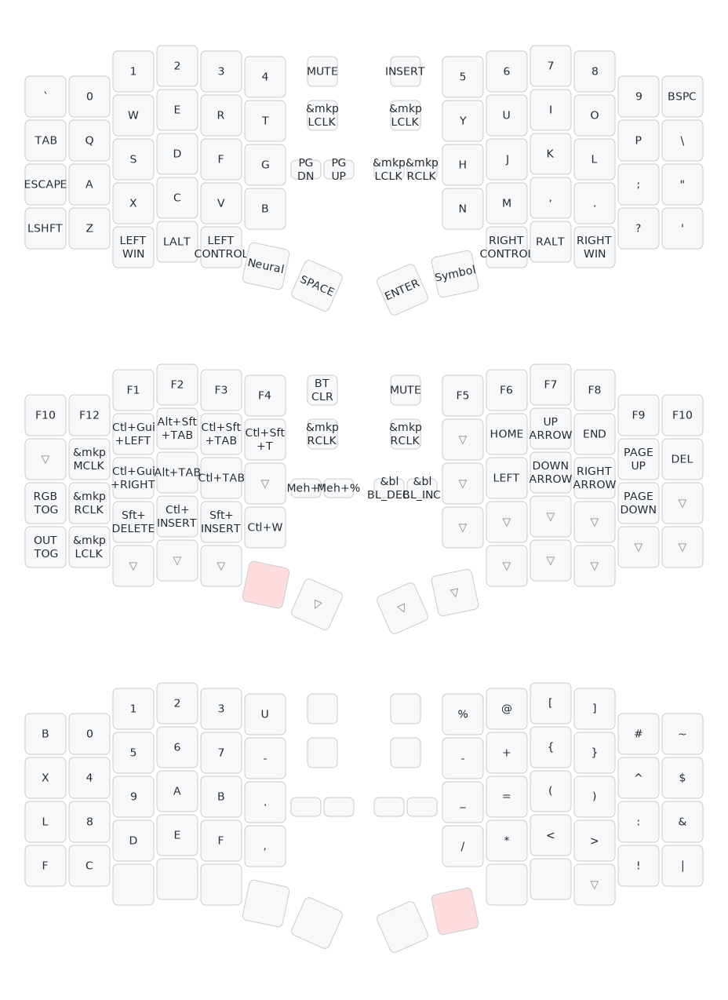

# zmk_config_zitaotech_sofle

ZMK firmware configuration for ZitaoTech Sofle split keyboard (nRF52840).

## 硬件特性 (Hardware)

| 组件     | 左手 (Central)                    | 右手 (Peripheral)     |
| -------- | --------------------------------- | --------------------- |
| MCU      | nRF52840                          | nRF52840              |
| 编码器   | EC11 (左旋钮)                     | EC11 (右旋钮)         |
| 指点设备 | BB Trackball / BB Trackpad (A320) | Trackpoint (I2C 0x15) |
| 显示屏   | LPM View (Memory LCD)             | LPM View (Memory LCD) |
| 背光     | PWM 键盘背光 + 轨迹球背光         | PWM 键盘背光          |
| 灯效     | WS2812 ×1                         | WS2812 ×1             |
| 电池     | 电压分压监测                      | 电压分压监测          |

## 键盘布局 (Keymap)



## 层设计 (Layers)

### Layer 0 — Nexys (默认层)

标准 QWERTY 布局，设计特点：

- **ESC 替代 CapsLock**：ESC 放在传统 CapsLock 位置（Vim/终端友好）
- **对称拇指区**：左手 Win / Alt / Ctrl / Layer1 / Space；右手 Enter / Layer2 / RCtrl / RAlt / RWin — 两侧均有完整修饰键
- **旋钮按下 = 静音**：左右旋钮按下均为 C_MUTE
- **轨迹球/指点杆按下 = 鼠标左键**
- **额外按键**：左手额外键为 PG_DN / PG_UP（快速翻页），右手额外键为鼠标左键 / 右键
- **左旋钮**：上下方向键；**右旋钮**：左右方向键

### Layer 1 — Neural (功能层)

桌面/窗口管理 + 外设控制：

- **F1–F12**：完整功能键行，DEL 在右上角
- **导航集群**（右手侧）：Home / End / PgUp / PgDn + 方向键形成完整导航区
- **标签页切换**：Ctrl+Tab / Ctrl+Shift+Tab（应用/浏览器标签切换）
- **关闭窗口**：Ctrl+W
- **RGB 开关** / **蓝牙清空** / **输出切换**（USB/BLE）
- **键盘背光增减**
- **F11 / F12** 在右下角
- **左下角**：Bootloader 复位键
- 指点设备在**此层自动切换为滚轮模式**
- **左旋钮**：音量 +/-；**右旋钮**：Backspace / Delete

### Layer 2 — Symbol (符号层)

双手分工明确：**左手输入十六进制数字，右手输入编程符号**。

#### 左手 — 十六进制数字小键盘

```
0  1  2  3
4  5  6  7
8  9  A  B
C  D  E  F
```

4×4 标准十六进制键位，覆盖 0–9 + A–F。优势：

- **单手输入十六进制**：颜色码（`#FF00AA`）、内存地址、Unicode 码点（`U+1F600`）、MAC 地址等无需切换手位
- **保留主键位手指记忆**：每列手指分配与 QWERTY 主层一致（食指负责最左列 KP_0/4/8/C，无名指负责 KP_2/6/9/D 等），过渡自然
- **左右手并行**：左手输数字的同时右手可立即跟上符号（如 `#` `[` `(`），写入 `#FF0000` 或 `[0x12]` 一气呵成

#### 右手 — 成对符号分区

```
%   @   [   ]   #   ~
-   +   {   }   ^   $
_   =   (   )   :   &
/   *   <   >   !   |
```

符号的排列遵循两条核心规则：

**1. 括号按「开/关」垂直分列**

```
[   ]        ← 方括号 (square)
{   }        ← 花括号 (curly)
(   )        ← 圆括号 (paren)  ← 常驻手势排，无需移动
```

- **中指列 = 所有开括号** `[ { (`
- **无名指列 = 所有闭括号** `] } )`
- 圆括号 `( )` 放在手势排（home row），使用频率最高且无需任何手指位移即可按下
- 方括号 `[ ]` 放顶部、花括号 `{ }` 居中，按频率分层

**2. 关联符号成组**

- `+ - * / =` 数学运算符聚集在右手食指/中指区域
- `< >` 沿袭开/闭列规则，中指 `<` 无名指 `>`
- `: &` 同行相邻（C++ 引用 `:&` 常见组合）
- `! |` 同行相邻（逻辑/位运算常用组合）
- `^ $` 同行相邻（正则/字符串结尾常用）

- **右下角**：Bootloader 复位键
- **左旋钮**：蓝牙配置切换；**右旋钮**：Backspace / Delete

#### 与默认层的对比 — 设计意图

默认 QWERTY 层的符号是历史遗留布局：数字行符号横跨双手且需 Shift，括号 `( ) [ ] { }` 分散在数字行，`< >` 依赖 Shift 组合键。Symbol 层在此基础上做了针对性的优化：

**1. 保留 QWERTY 手指记忆的键位复用**

以下是三层符号中与默认层 Shift 结果完全一致的物理键位：

| 默认层按键 | 默认层 + Shift | Symbol 层 | 说明 |
|---|---|---|---|
| `;` | `:` | `:` | 同键位，零学习成本 |
| `,` | `<` | `<` | 同键位，零学习成本 |
| `.` | `>` | `>` | 同键位，零学习成本 |

这三个高频符号直接复用了默认层的手指记忆——从默认层切换到 Symbol 层时，手指不需要重新学习这些键的位置。

**2. 从「双手 Shift 组合」到「单手直接输入」**

默认层输入 `()` 需要：右手 Shift + 左手 N9/N0，或左手 Shift + 右手按。Symbol 层 `( )` 直接放在右手手势排的中指和无名指列，无需 Shift、无需双手协调。

默认层输入 `[] {}` 同样需要 Shift + 数字行组合键，Symbol 层将其垂直堆叠在开/闭列上，形成统一的括号输入通道。

**3. 左右手并行流水线**

默认层输入表达式 `(0x1A + 5)` 的流程：
> 右手 Shift → 左手 9 → 松开 → 右手找 0 → 左手找 x → ... → 右手 Shift → 左手 0

两只手反复交替、持续找键。Symbol 层下：
> 左手只管数字（0 → x → 1 → A → + → 5），右手只管括号 `(` `)`

双手各司其职、互不阻塞，形成输入流水线。

**4. 拇指区全 `&none` — 防误触**

Symbol 层拇指区全部禁用，仅右下角保留 Bootloader。进入 Symbol 层靠按住默认层拇指的 `mo 2`，松开自动回默认层。过程中不会因拇指误触跳到其他层。

**5. 指点设备按键静默**

轨迹球和指点杆的按压在 Symbol 层设为 `&none`，打字时不会误触鼠标点击，但移动/滚轮功能照常工作。

## 指点设备行为 (Pointing Device)

- **Layer 0 / Layer 2**：正常鼠标移动
- **Layer 1 (Neural)**：自动切换为滚轮模式，无需按住任何按键
- 轨迹球 (左)：GPIO 脉冲输入，4 方向 Hall 传感器，带指数加速曲线
- 指点杆 (右)：I2C 地址 0x15，速度随 LED 亮度动态调节，滚动速度按位移分级缩放

> 驱动参数详见 `config/zitaotech_sofle_keymap_reference.conf`

## 编译 (Build)

```bash
# 左手 (轨迹球版)
west build -p -b zitaotech_sofle_left -- -DSHIELD="lpm_view;left_bbtrackball"

# 左手 (触摸板版)
west build -p -b zitaotech_sofle_left -- -DSHIELD="lpm_view;left_bbtrackpad"

# 右手
west build -p -b zitaotech_sofle_right -- -DSHIELD="lpm_view;right_trackpoint"

# 带 settings reset（清除蓝牙配对信息）
west build -p -b zitaotech_sofle_right -- -DSHIELD="lpm_view;right_trackpoint;settings_reset"
```

## 键位矩阵参考

矩阵索引及详细硬件映射见 `config/zitaotech_sofle_keymap_reference.conf`。
